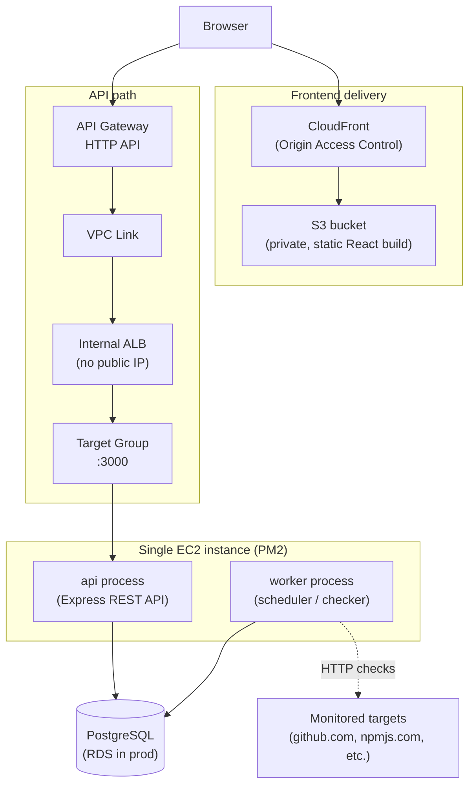

# UpTrack

An uptime/status monitor, built as a portfolio project to demonstrate hands-on AWS infrastructure and DevOps work rather than another PaaS deploy. A background worker polls a configurable list of targets on independent intervals and records status, latency, and incident history to Postgres; a public dashboard shows current status, uptime history, and response-time trends.

**Live demo:** https://d3tqalcvoccwnc.cloudfront.net
**API:** https://ik0jt2bkga.execute-api.us-west-2.amazonaws.com/status

---

## Why this architecture

Most side projects ship on Vercel/Render/Railway and stop there. This one is deliberately built on persistent infrastructure instead, to demonstrate the skills that PaaS platforms abstract away entirely:

- A real Linux server (EC2) running two long-lived processes under a process manager (PM2), configured to survive reboots via a proper systemd unit — not a container that restarts itself.
- A private backend that is never directly reachable from the internet. Public traffic terminates at API Gateway, crosses a VPC Link into the VPC, hits an internal Application Load Balancer, and only then reaches the EC2 instance — the instance's application port is closed to everything except the load balancer.
- Security groups scoped by reference to other security groups (least privilege), not broad CIDR ranges.
- A real CI/CD pipeline (GitHub Actions) that builds, tests infrastructure assumptions, and deploys both halves of the stack independently on every push to `main` — no manual "run this script" step.
- No serverless/Lambda anywhere. The point is demonstrating a persistent server setup, on purpose.

## Architecture



| Layer | Technology |
|---|---|
| Frontend | React + Vite + TypeScript, Tailwind CSS — static build, no SSR |
| Frontend hosting | S3 (private) behind CloudFront, Origin Access Control |
| Backend | Node.js + TypeScript + Express, behind a reverse proxy (respects `X-Forwarded-*`, reads port from env) |
| Process management | PM2 running two processes (`api`, `worker`) on one EC2 instance, systemd-registered for reboot survival |
| Database | PostgreSQL via Prisma ORM |
| Public API entry | AWS API Gateway (HTTP API) → VPC Link → internal ALB — EC2 is never internet-facing |
| CI/CD | GitHub Actions — independent frontend and backend deploy jobs on push to `main` |

## Data model

- **`targets`** — id, name, url, check_interval_seconds, created_at
- **`checks`** — id, target_id (FK), checked_at, status_code, latency_ms, is_up — indexed on `(target_id, checked_at)`
- **`incidents`** — id, target_id (FK), started_at, resolved_at (nullable), cause (nullable)

**Incident detection** only opens an incident after N consecutive failed checks (default 3, configurable via `INCIDENT_FAILURE_THRESHOLD`) to avoid flapping on transient blips, and auto-resolves on the first successful check after opening.

## API

| Method | Path | Notes |
|---|---|---|
| `GET` | `/status` | Overall summary — powers the "all systems operational" banner |
| `GET` | `/targets` | List all targets with current status |
| `GET` | `/targets/:id` | Target detail |
| `GET` | `/targets/:id/history?window=24h\|7d\|30d` | Check history + uptime % for the window |
| `GET` | `/targets/:id/incidents` | Incident history |
| `POST` | `/targets` | Add a target - requires the `X-Uptrack-Key` header (value = `API_KEY` env) |

### Adding targets from the dashboard

The homepage includes an **Add target** form (name, URL, check interval, API key). The key is sent as `X-Uptrack-Key` (not `X-API-Key` - API Gateway reserves that name) and kept in `sessionStorage` for the browser session. Without a valid key the form returns 401 - public visitors can still read status.

If you use the live CloudFront site, the key must match **`API_KEY` on the EC2 backend**, not just your local `.env`. Also allow the `X-Uptrack-Key` header in API Gateway CORS settings.

You can also add targets with curl:

```bash
curl -X POST http://localhost:3000/targets \
  -H "Content-Type: application/json" \
  -H "X-Uptrack-Key: $API_KEY" \
  -d '{"name":"Example","url":"https://example.com","checkIntervalSeconds":60}'
```

## Local development

```bash
# backend
cd backend
cp .env.example .env      # fill in DATABASE_URL, API_KEY, etc.
npm install
npx prisma migrate dev
npm run db:seed
npm run dev:api            # terminal 1
npm run dev:worker          # terminal 2

# frontend
cd frontend
npm install
npm run dev                 # VITE_API_URL defaults to http://localhost:3000
```

### Environment variables

**Backend**

| Variable | Purpose | Default |
|---|---|---|
| `DATABASE_URL` | Postgres connection string | required |
| `PORT` | API listen port | `3000` |
| `API_KEY` | Required header for `POST /targets` | required |
| `INCIDENT_FAILURE_THRESHOLD` | Consecutive failures before opening an incident | `3` |
| `CHECK_TIMEOUT_MS` | Per-check HTTP timeout | `10000` |
| `FRONTEND_ORIGIN` | Comma-separated list of allowed CORS origins | `http://localhost:5173` |

**Frontend**

| Variable | Purpose |
|---|---|
| `VITE_API_URL` | Base URL the dashboard calls — baked in at build time |

## Deployment

Two independent PM2 processes run on the EC2 instance, defined in `ecosystem.config.js`:

- **`api`** — the Express REST API
- **`worker`** — the background scheduler, checking each target on its own `check_interval_seconds` interval, writing results to Postgres. A single target's failure is isolated and never blocks or crashes checks for other targets.

PM2 is registered as a systemd service (`pm2 save` + `pm2 startup`), so a reboot of the EC2 instance restarts both processes automatically without manual intervention.

### CI/CD

`.github/workflows/deploy.yml` runs two jobs on every push to `main`:

- **`deploy-frontend`** — installs deps, builds the Vite app with `VITE_API_URL` baked in, syncs the output to S3, invalidates the CloudFront cache.
- **`deploy-backend`** — installs deps, builds the TypeScript backend, regenerates the Prisma client, copies the build artifacts to EC2 over SSH, runs `prisma migrate deploy` against production, and does a zero-downtime `pm2 reload`.

SSH is used for the backend deploy today (key-based auth, no password access). AWS Systems Manager Session Manager is the better long-term answer — no inbound port 22 at all, IAM-based access, full audit trail — and is the natural next hardening step.

## Engineering notes

A few of the less obvious problems solved while building this, since "it deployed on the first try" is rarely the interesting part:

- **API Gateway silently overriding backend CORS headers.** The Express API had correct `cors` middleware from the start, but the dashboard still failed with `No 'Access-Control-Allow-Origin' header` errors. Isolated the cause by testing the same request at three points in the chain — directly against `localhost:3000` (headers present and correct), through the internal ALB (fine), and through API Gateway (headers missing) — which narrowed it to API Gateway's own CORS configuration, which unconditionally replaces whatever CORS headers the backend integration returns, rather than passing them through. Fixed by configuring CORS correctly at the API Gateway layer instead of relying on the app.
- **Least-privilege security group chaining.** The ALB only accepts inbound traffic from the VPC Link's security group; the EC2 instance only accepts the application port from the ALB's security group. Neither is reachable via a broad CIDR block — access is scoped security-group-to-security-group at every hop.
- **PM2 environment reloads.** `pm2 restart` does not reliably reload environment variables from a `.env` file — `pm2 restart <name> --update-env` is required, otherwise a config change can silently keep running under the old environment.
- **CI failure triage from masked logs.** GitHub Actions masks secret values in job logs, which makes a malformed-secret bug (an empty or whitespace-only value) look identical to a generic connection failure. Diagnosed by reading the job's own `env:` summary block — a genuinely empty secret prints with no mask at all, distinguishing it from a present-but-wrong one.
- **Prisma CLI vs. runtime dependencies.** The backend deploy step originally ran `npm ci --omit=dev` to keep the EC2 install lean, but `prisma` (the CLI, used for `migrate deploy`) is a devDependency while `@prisma/client` (the runtime library) is not — so the omit flag silently broke migrations on the very first real deploy. Caught before it hit production by tracing exactly which package each command needed.

## Known tradeoffs

- SSH is open to `0.0.0.0/0` (key-auth only) so GitHub's runners can reach the instance — GitHub Actions doesn't originate from a fixed IP range. SSM Session Manager is the correct long-term fix.
- Infrastructure was provisioned by hand through the AWS console rather than as Terraform/CloudFormation — reproducible by following the steps above, not by running one command.
- No test gate in the deploy pipeline yet — `npm test` runs locally but isn't wired into `deploy.yml` as a required step before deploy.
