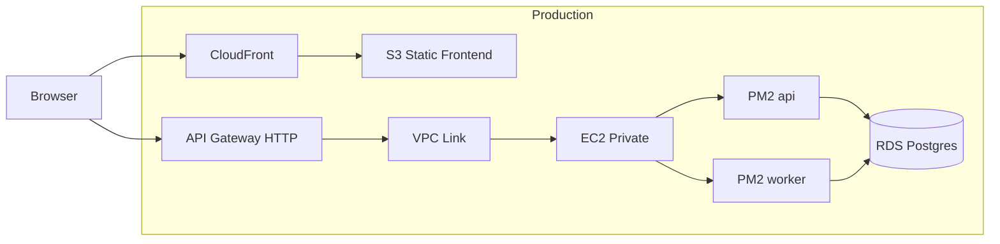

# uptrack

A self-hosted uptime monitor built to demonstrate real AWS/DevOps skills: static React on S3/CloudFront, Express API + background worker on EC2 under PM2, PostgreSQL on RDS, and API Gateway with a VPC Link in production.

## Architecture



### PM2 processes

Two separate Node.js processes run on the same EC2 instance:

| Process | Role |
|---------|------|
| **api** | Serves the REST API. Read-only for the public dashboard. |
| **worker** | Polls configured URLs on their intervals and writes checks, incidents, and uptime rollups to Postgres. |

Both processes share the same database. There is no inter-process communication — the worker writes data, the API reads it.

## Prerequisites

- Node.js 20+
- Docker (for local Postgres)
- AWS CLI (for production deploys)

## Local development

### 1. Start Postgres

```bash
docker compose up -d
```

Local Postgres listens on **host port 5434** to avoid conflicting with other Postgres containers on 5432/5433.

### 2. Backend setup

```bash
cd backend
cp ../.env.example .env
npm install
npx prisma migrate dev
npx prisma db seed
```

### 3. Run API and worker (separate terminals)

```bash
# Terminal A
npm run dev:api

# Terminal B
npm run dev:worker
```

### 4. Frontend

```bash
cd frontend
cp .env.example .env
npm install
npm run dev
```

Open [http://localhost:5173](http://localhost:5173). The dashboard polls the API every 30 seconds.

## Environment variables

| Variable | Required | Description |
|----------|----------|-------------|
| `DATABASE_URL` | Yes | Postgres connection string |
| `PORT` | No | API port (default `3000`) |
| `API_KEY` | Yes | Secret for `POST /targets` via `X-API-Key` header |
| `INCIDENT_FAILURE_THRESHOLD` | No | Consecutive failures before opening an incident (default `3`) |
| `CHECK_TIMEOUT_MS` | No | HTTP check timeout in ms (default `10000`) |
| `FRONTEND_ORIGIN` | No | Comma-separated CORS origins (default `http://localhost:5173`) |
| `VITE_API_URL` | Frontend | API base URL at build time |

## API

### Public (read-only)

- `GET /status` — overall system summary
- `GET /targets` — all targets with current status and 24h uptime
- `GET /targets/:id` — target detail
- `GET /targets/:id/history?window=24h|7d|30d` — check history + uptime %
- `GET /targets/:id/incidents` — incident history

### Protected

- `POST /targets` — add a target (requires `X-API-Key` header)

```bash
curl -X POST http://localhost:3000/targets \
  -H "Content-Type: application/json" \
  -H "X-API-Key: dev-secret-change-me" \
  -d '{"name":"Example","url":"https://example.com","checkIntervalSeconds":60}'
```

## Production deployment

GitHub Actions (`.github/workflows/deploy.yml`) runs on push to `main`:

1. **deploy-frontend** — builds the Vite app, syncs `frontend/dist/` to S3, invalidates CloudFront
2. **deploy-backend** — builds TypeScript, copies artifacts to EC2 via SSH, runs migrations, reloads PM2

### GitHub secrets required

| Secret | Used by |
|--------|---------|
| `AWS_ACCESS_KEY_ID`, `AWS_SECRET_ACCESS_KEY`, `AWS_REGION` | Both jobs |
| `S3_BUCKET`, `CF_DISTRIBUTION_ID`, `VITE_API_URL` | Frontend |
| `EC2_HOST`, `EC2_USER`, `EC2_SSH_KEY` | Backend |

On EC2, place a `.env` file in `~/uptrack/backend/` with production values (`DATABASE_URL`, `API_KEY`, etc.). PM2 loads it via `dotenv` at process start.

> **Note:** SSH deploy is fine to start. Prefer [AWS Systems Manager Session Manager](https://docs.aws.amazon.com/systems-manager/latest/userguide/session-manager.html) long-term — no open port 22, IAM-based access, audit trail.

### PM2 commands (on EC2)

```bash
cd ~/uptrack
pm2 start ecosystem.config.js --env production
pm2 logs worker
pm2 reload ecosystem.config.js --env production
```

## Testing

```bash
cd backend
npm test
```

Vitest covers incident detection (consecutive failure threshold, auto-resolve) and uptime calculation (rollup merge, window boundaries).

## Project structure

```
uptrack/
├── frontend/          # Vite + React + Tailwind (static S3 build)
├── backend/           # Express API + worker + Prisma
├── ecosystem.config.js
├── docker-compose.yml
└── .github/workflows/deploy.yml
```
